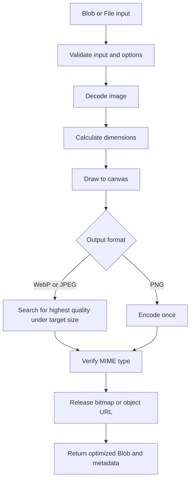
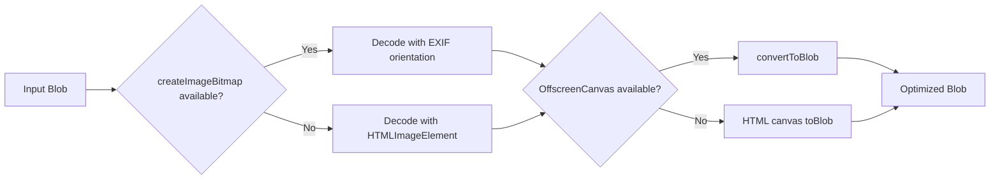
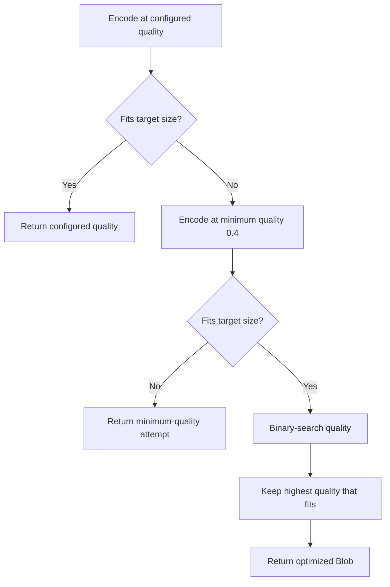

# ImageSlim

Framework-agnostic browser image resizing and compression for TypeScript and JavaScript.

ImageSlim has no Angular, React, Vue, or Svelte dependencies. It accepts a `Blob`, uses
browser image APIs, and returns an optimized `Blob` with useful metadata.

## Contents

- [Install](#install)
- [Usage](#usage)
- [How it works](#how-it-works)
- [API](#api)
- [Browser behavior](#browser-behavior)
- [Angular](#angular)
- [Local package testing](#local-package-testing)
- [License](#license)

## How it works

ImageSlim keeps the original decoded image in memory and renders every output attempt
from that same source. This makes resizing deterministic and allows the quality search to
compare output sizes without repeatedly decoding the input.



### Browser processing path

The implementation progressively selects the best browser API available. It prefers
modern APIs but still supports browsers that only provide the traditional image and
canvas interfaces.



### Target-size quality search

For WebP and JPEG, `targetSize` is treated as a maximum byte size. The search keeps the
highest quality that fits. If the target is impossible at the minimum quality, the
smallest attempt is returned and `targetSizeReached` becomes `false`.



[Back to contents](#contents)

## Install

```bash
npm install @mohamedwaelgd/image-slim
```

[Back to contents](#contents)

## Usage

```ts
import { optimizeImage } from '@mohamedwaelgd/image-slim';

const result = await optimizeImage(file, {
  maxWidth: 1920,
  maxHeight: 1080,
  format: 'webp',
  quality: 0.82,
  targetSize: 700_000,
});

const formData = new FormData();
formData.append('file', result.blob, 'image.webp');
```

`File` objects work automatically because `File` extends `Blob`.

[Back to contents](#contents)

## API

```ts
interface ImageOptimizationOptions {
  maxWidth?: number;
  maxHeight?: number;
  format?: 'webp' | 'jpeg' | 'png';
  quality?: number;
  targetSize?: number;
  maxInputSize?: number;
  allowUpscale?: boolean;
  backgroundColor?: string;
}
```

Defaults are `1920 x 1920`, WebP, quality `0.82`, a `1,000,000` byte target, and a
`15,000,000` byte maximum input size. Images are not enlarged unless `allowUpscale` is
set to `true`.

The result includes original and optimized dimensions, sizes, MIME types, and the final
quality. If the target cannot be reached at the minimum quality, ImageSlim returns the
smallest attempt and sets `targetSizeReached` to `false`; it does not throw or silently
reduce dimensions.

```ts
interface OptimizedImageResult {
  blob: Blob;
  original: {
    size: number;
    width: number;
    height: number;
    type: string;
  };
  optimized: {
    size: number;
    width: number;
    height: number;
    type: string;
  };
  reductionPercentage: number;
  targetSizeReached: boolean;
  quality: number;
}
```

[Back to contents](#contents)

## Browser behavior

- JPEG, PNG, and WebP inputs are accepted.
- WebP, JPEG, and PNG outputs are supported when the browser encoder supports them.
- `createImageBitmap` is preferred, with an HTML image fallback.
- `OffscreenCanvas` is preferred, with regular canvas fallback.
- EXIF orientation is requested through `createImageBitmap`.
- Aspect ratio is preserved and images are not enlarged by default.
- Quality search encodes every attempt from the same decoded source.
- Transparent pixels are composited onto white when producing JPEG. Set `backgroundColor`
  to use another CSS color.
- Unsupported input types, output encoders, invalid options, and unavailable canvas APIs
  throw `ImageSlimError` with a stable `code`.

The package targets modern browsers with Canvas support. Run the Chromium smoke tests
locally with `npm run test:browser`.

[Back to contents](#contents)

## Angular

ImageSlim is consumed like any other browser library from Angular:

```ts
import { optimizeImage } from '@mohamedwaelgd/image-slim';

async function imageSelected(file: File) {
  const { blob } = await optimizeImage(file, { format: 'webp' });
  // Send blob with Angular HttpClient and FormData.
}
```

[Back to contents](#contents)

## Local package testing

```bash
npm run validate:package
npm pack
```

Install the generated tarball from another application to test the same files that npm
consumers receive.

[Back to contents](#contents)

## License

MIT. See [LICENSE](./LICENSE).

[Back to contents](#contents)
